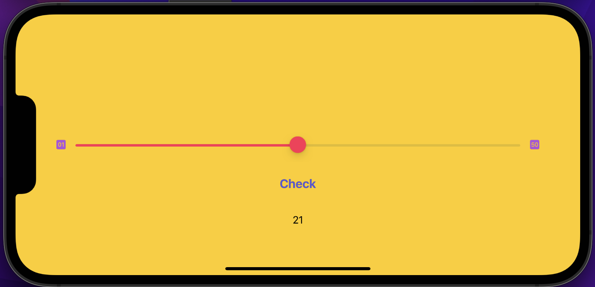

# Right on Target 

1. The app randomly chooses an integer number from 1 to 50 and tells the player, displaying it in a text label.
2. The player sets the slider on the slider to the position that he thinks corresponds to the number. The leftmost slider position corresponds to 1, the rightmost to 50.
3. The player confirms the chosen position of the slider by pressing the button.
4. The app determines how close to the chosen number the value on the slider is and calculates the amount of points earned.

One game lasts five rounds. The goal is to get the maximum total number of points. The difficulty is that the player has to navigate by eye.
